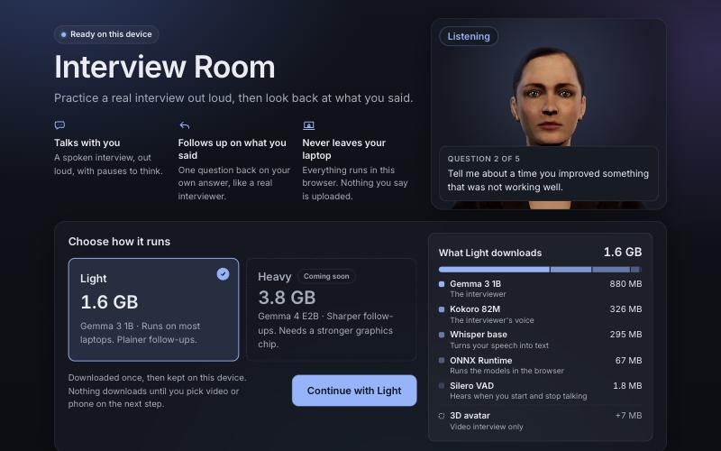
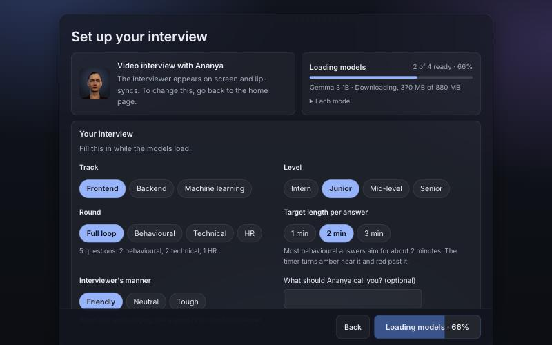
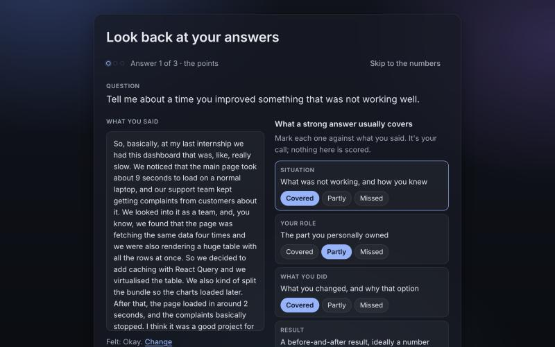
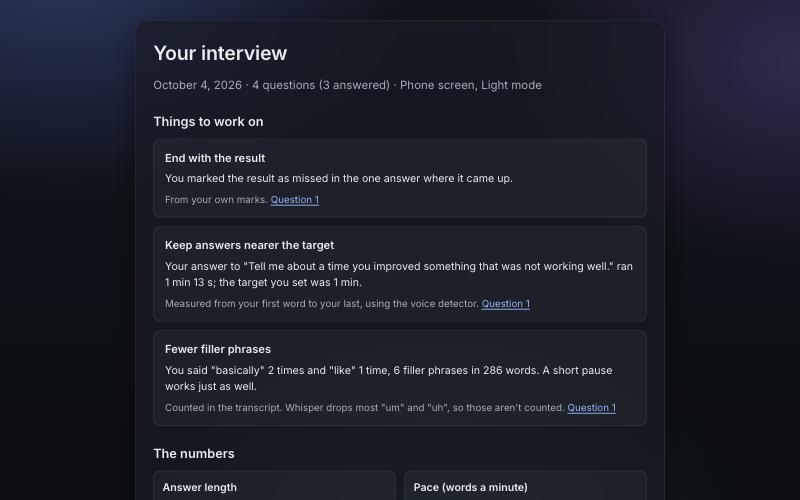
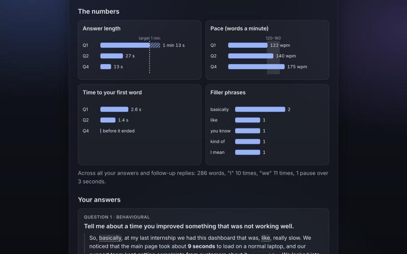
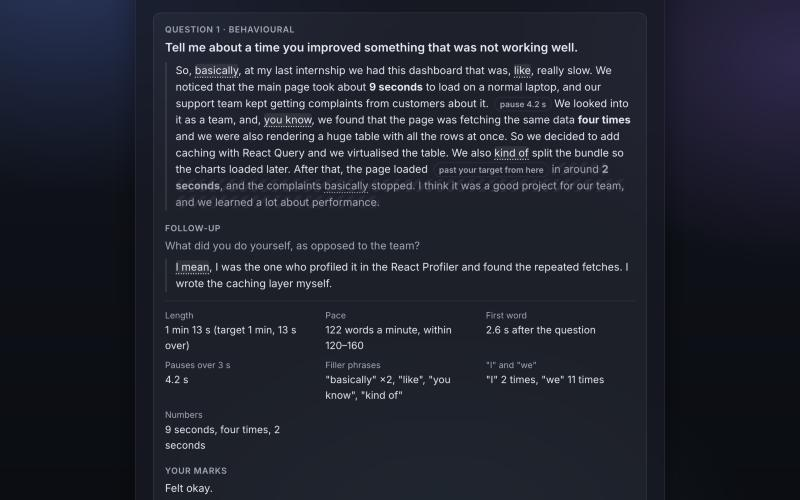
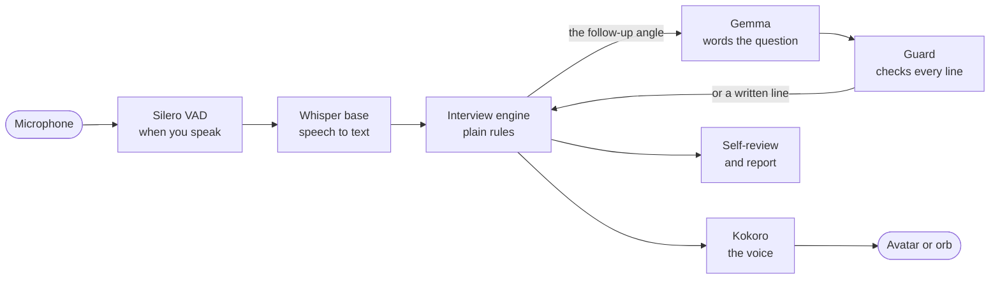

# Interview Room

A spoken mock interviewer for software engineers. You answer out loud, it
listens, asks a follow-up on what you actually said, and at the end you look
back at your own answers next to what a strong answer covers, with the
measured numbers beside them.

**Everything runs in your browser.** Speech recognition, the interviewer, its
voice and the avatar all run on your own device. Nothing you say is uploaded;
the only network use is downloading the models the first time (kept on your
device after that) and the Inter font from Google Fonts.

**Live demo:** https://interview-room-iooj.onrender.com (Chrome or Edge on a
laptop or desktop with WebGPU)

Built for the DEV Hacktoberfest Weekend Challenge: Build for a Friend, for a
friend who practices interviews alone.



## What it does

- **A real interview, out loud.** A short hello, then the questions, a
  follow-up on each answer, and "any questions for me?" at the end. Frontend,
  backend and machine learning tracks; behavioural, technical and HR rounds,
  or a full loop (2 behavioural, 2 technical, 1 HR). Intern to senior.
- **Pauses are fine.** An answer ends when you press **I'm done** or stay
  quiet for about 5 seconds, never at a short thinking pause.
- **Follows up on what you said.** Plain rules pick what to ask about: a
  short answer, "we" with no "I", no result, a missing key point, an edge
  case. Gemma only words that question, and a guard checks every line before
  it is spoken.
- **Two ways to meet the interviewer.** A video interview with a lip-synced
  3D avatar (Ananya or Aarav), or a phone screen with a light that responds
  to whoever is talking.
- **You can talk to it.** "Can you repeat that?", "What do you mean?", "I
  don't know", "Can we skip this one?", "Give me a minute", "I'm ready",
  "Stop the interview". It also copes with silence, a lost microphone, a
  hidden tab, and Gemma failing mid-interview (it carries on with written
  follow-ups).
- **You review your own answers.** After the interview, one answer at a
  time: how did it feel, then 3 to 5 points a strong answer usually covers,
  each marked covered, partly or missed. About a minute or two, keyboard
  friendly, and you can skip straight to the numbers.
- **A report with no scores.** Up to three things to work on, picked by
  plain rules from your marks and the numbers, each saying where it came
  from. Gentle second looks where your marks and the numbers disagree (the
  result marked covered, but no number was heard). Your words quoted with the
  measured parts marked, plain charts, and **Practice this one again** on
  every answer. Saved on your device; prints to PDF.

| Setup | Self-review |
|---|---|
|  |  |

| Things to work on | The numbers | An answer |
|---|---|---|
|  |  |  |

## What the report measures

Only measured numbers, each explained on the page. The app never judges an
answer: the marks are yours.

| Number | How it is measured |
|---|---|
| Answer length | From your first word to your last, using the voice detector, across thinking pauses |
| Pace | Words Whisper heard, divided by the time you were actually talking (shown against 120–160 words a minute) |
| Time to first word | From when the interviewer finished asking (or finished a repeat you asked for) to your first word |
| Long pauses | Gaps of more than 3 seconds between stretches of speech |
| Filler phrases | "you know", "I mean", "basically", "kind of", "sort of", and "like" next to a comma. Whisper drops most "um" and "uh", so those are not counted |
| "I" and "we" | I, me, my… against we, us, our… |
| Numbers | Figures and spoken numbers ("9 seconds", "two hundred users"); years and vague amounts ("one or two") left out |

Skipped or silent answers are shown as such, not measured. Missing timings
show as "not measured", never as a guess.

## Models

All open-weight, all running in the browser through
[transformers.js](https://github.com/huggingface/transformers.js) and ONNX
Runtime Web on WebGPU.

| Job | Model | Size | Licence |
|---|---|---|---|
| Hears when you start and stop talking | Silero VAD | 1.8 MB | MIT |
| Turns your speech into text | Whisper base | 295 MB | MIT |
| The interviewer's voice | Kokoro 82M (fp32) | 326 MB | Apache 2.0 |
| The interviewer, **Light** | Gemma 3 1B (q4) | 880 MB | Gemma Terms of Use |
| The interviewer, **Heavy** (coming soon) | Gemma 4 E2B (q4f16) | 3.1 GB | Apache 2.0 |
| Runs the models | ONNX Runtime Web | 67 MB | MIT |
| The interviewer on screen (video only) | 3D avatar | 7 MB | from react-ai-voice-avatar |

The first visit downloads about **1.6 GB** for Light (plus 7 MB for a video
interview). Gemma, Whisper and Kokoro are kept in the browser's private
storage (OPFS), so the next visit loads in seconds.

**Light** runs on most laptops with WebGPU. **Heavy** gives sharper
follow-ups but needs `shader-f16` and much more memory; it shows as "coming
soon" until it works end to end. The home page checks the device first and
says plainly if this browser cannot run the models.

## How it works



- **The engine** (`src/interview/`) is plain TypeScript: what to ask, when an
  answer is finished, what to follow up on, and what to do when something
  goes wrong. It always tells the voice package to keep listening and speaks
  its own lines.
- **Gemma** (`src/gemma/`) runs in its own Web Worker. It is only asked to
  word the follow-up the rules chose; if it is slow (6 s), off topic, or
  fails, a written line is used instead.
- **The report** (`src/report/`) works from what the engine recorded and the
  voice detector's timings: plain functions, no model, instant. Reports and
  your marks are kept in IndexedDB.
- **The voice, avatar and microphone** come from
  [react-ai-voice-avatar](https://github.com/927tanmay/react-ai-voice-avatar)
  (below).

More detail: [docs/ARCHITECTURE.md](docs/ARCHITECTURE.md),
[docs/PLAN.md](docs/PLAN.md), [docs/UX.md](docs/UX.md) (the design rules),
[docs/MODEL-TESTS.md](docs/MODEL-TESTS.md) (how Light and Heavy were chosen),
[docs/TASKS.md](docs/TASKS.md).

## Run it locally

Needs Node 20.19 or newer (the project uses 24.9, see `.node-version`) and a
browser with WebGPU: a recent Chrome or Edge on a laptop or desktop.

```bash
npm ci
```

```bash
npm run dev
```

Open http://localhost:5173. The dev server sends the cross-origin isolation
headers (COOP and COEP) the multithreaded WebAssembly runtime needs, the same
as the deployed site.

```bash
npm run build
```

```bash
npm run lint
```

**Dev-only pages** (not in the production build), for working without
downloading the models:

| URL | What it shows |
|---|---|
| `?dev=report` | A fake interview run through the real engine, then the self-review and report |
| `?dev=setup` | The setup screen with sample loading states (`&load=ready`, `&step=choose`) |
| `?dev=room` | The interview room with the real engine and no models (drive it with `__room.heard('…')` in the console) |
| `?dev=avatar` | The avatar framing (`&who=aarav`) |
| `?dev=gemma` | The Gemma worker on its own |
| `?device=no-f16` | Fakes a weaker device (also `no-webgpu`, `no-adapter`, `software-gpu`) |

## Deploy

`render.yaml` is a Render Blueprint for a free static site: it builds with
`npm ci && npm run build`, serves `dist/`, and sets the COOP/COEP headers.
No model files are hosted: they come from Hugging Face and jsDelivr at run
time.

## react-ai-voice-avatar

The voice, the lip-synced avatar and the microphone handling come from
[react-ai-voice-avatar](https://github.com/927tanmay/react-ai-voice-avatar),
an npm package I maintain. Interview Room itself is new. During the
challenge weekend the package got the fixes this app needed, released as
0.7.0:

- Answers longer than 30 seconds are transcribed whole (Whisper chunking).
- An empty reply from `onSubmit` ends the turn and keeps listening, so one
  answer can be collected across pauses.
- `onSubmit` gets `speechMs`, how long you actually spoke, for the pace.
- `react-ai-voice-avatar/model-cache` exports the OPFS cache, so the app's
  own Gemma worker keeps its model on the device too.

## Known limits

- Whisper base can mishear technical terms and names, so quotes are not
  always word for word.
- Light's follow-ups are plainer than Heavy's, and Heavy is not available
  yet.
- Needs WebGPU: Chrome or Edge on a laptop or desktop. Phones are unlikely to
  run the models.
- The voice detector files and the ONNX runtime load from jsDelivr, so the
  app is not fully offline yet.
- System design questions are written but parked until that round is
  designed as a conversation.

## Credits and licences

The code is [MIT](LICENSE). The models keep their own licences (table above).
Thanks to the teams behind Gemma, Whisper, Kokoro, Silero VAD,
transformers.js, ONNX Runtime, three.js and React Three Fiber. The Inter font
is by Rasmus Andersson (SIL Open Font License).
