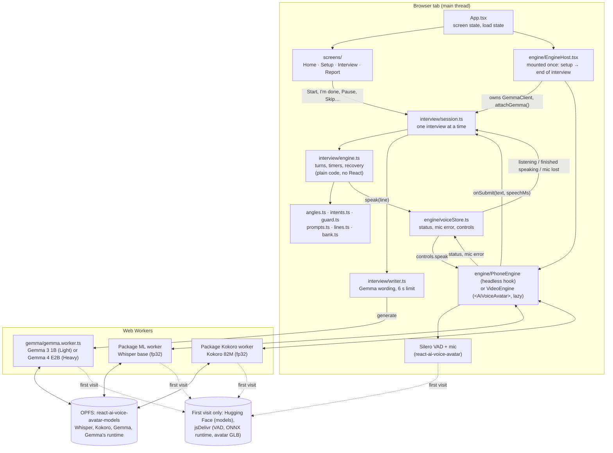
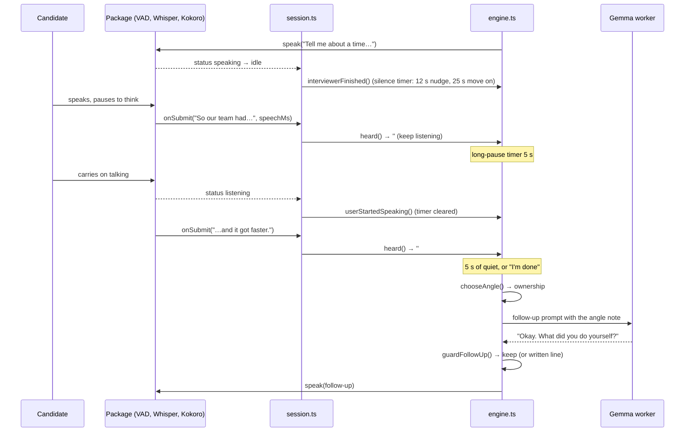

# Interview Room: architecture

How the app is put together, checked against the code on 4 Oct 2026 (after
step 3.6). Each box names the file that does it. See [PLAN.md](PLAN.md) for
what we are building and [TASKS.md](TASKS.md) for the order.

## 1. The pieces

Everything runs in the browser tab. The network is only used to download
models and app files the first time.

**Who decides what.** The engine (plain code) decides every step: what to
ask, when an answer is finished, when to move on, what went wrong. Gemma only
words the follow-up the rules chose, and the guard can veto it. Whisper hears,
Kokoro speaks, the package handles the microphone, VAD, barge-in and lip
sync.

## 2. One answer, start to finish

Short stretches at the start of an answer are checked for intents first
(`intents.ts`): repeat, "what do you mean", "I don't know", pause, resume,
stop, or garbled audio. They are handled out loud and never added to the
answer.

## 3. What is alive when

| Thing | Created | Ends | Why |
|---|---|---|---|
| Device check | App opens | never | Home screen needs it first |
| `EngineHost`, package workers, Gemma worker | Continue on the setup screen (video/phone picked) | Interview ends, or back to home | Workers die on unmount, so it is mounted once and screens change around it |
| Avatar canvas | With `VideoEngine` | With it | Kept off stage at a real size on setup so react-three-fiber mounts it |
| Interview engine | Interview screen opens | Next interview starts | Its last snapshot is what the report reads |
| Model files | First download | Browser storage cleared | OPFS, one file at a time, marker written only when complete |

## 4. Verified, and what to fix

Checked against the import graph and the code:

- **The engine is independent.** `interview/engine.ts` imports only other
  interview modules (no React, audio, Gemma or DOM), which is why it runs in
  Node: 88 checks of the guard, angles, intents, flow and recovery pass (a
  test script kept outside the repo so far).
- **Nothing the candidate says leaves the device.** No `fetch`,
  `XMLHttpRequest`, `sendBeacon` or WebSocket in the app code; the only
  network use is model and asset downloads by transformers.js and the package.
- **One engine mount from setup to the end** (DOM node identity checked in
  step 0.2), so workers keep running between screens.
- **Only the chosen Gemma downloads** (`GEMMA_MODELS[mode]`), and three.js
  only loads for a video interview (separate chunk).

To fix:

1. **Naming clash.** `src/engine/` is the voice engine, `src/interview/engine.ts`
   is the interview engine. Rename `src/engine/` to `src/voice/`
   (`VoiceHost`, `PhoneVoice`, `VideoVoice`). Mechanical, no behaviour change.
2. **Gemma ends with the interview.** `EngineHost` unmounts on the report
   screen and disposes the Gemma worker, but the Heavy deep review (phase H)
   needs Gemma on the report screen. Before phase H: keep the Gemma worker
   alive through the report (move its owner up to `App`, for the setup to
   report lifetime), while the voice engine still unmounts.
3. **Dead state.** `voiceStore` still keeps `said` and `heard` captions
   (written by `engineEvents.ts`), but the interview screen now shows the
   engine's own `interviewerLine` and `currentAnswer`. Remove them.
4. **Two copies of the voice engine.** Video runs `<AiVoiceAvatar>`'s own
   hook, phone runs the headless hook (the agreed workaround; an
   `AiVoiceAvatarView` export in the package after the challenge).
5. **Silence counting depends on the status changing from speaking.** If the
   voice fails to play a line, no silence timer starts and the interview waits
   for the candidate. Acceptable; the buttons still work.
6. **Self-host the VAD and ONNX runtime files** (step 6.1) so offline use
   and the privacy meter do not depend on jsDelivr.
